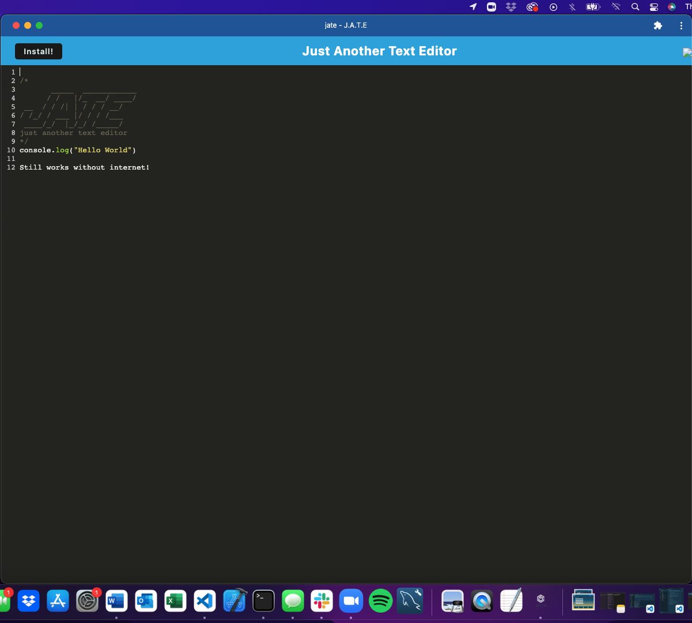

# PWA Text Editor 19

## Description

An easy to use in browser text editor that can be downloaded and installed to a user's machine for use when offline.

When a user opens the text editor, they are able to type directly in to the editor, and then they can click the "Install!" button in the top left hand corner and the application will download straight to their desktop.

## Screenshots

## Links

- Here is the repo: [gwenewasko/repo](https://github.com/gwenewasko/PWA-text-editor_19)
- Here is the deployed application: [gwenewasko/textedit](https://textedit-ge-app.herokuapp.com/)
